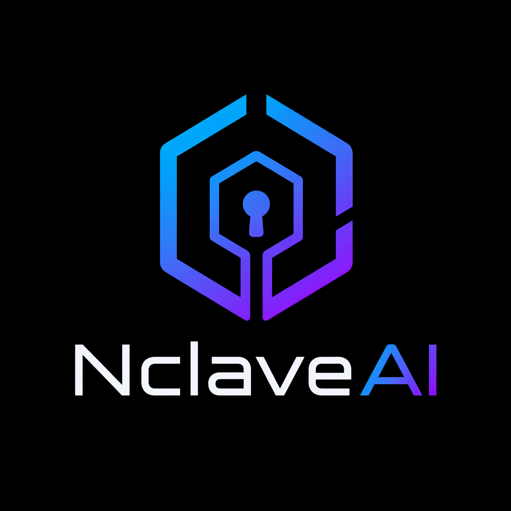

# NclaveAI: An Agentic Operating System

[](https://www.python.org/)
[](LICENSE)
[](tests/)

---

**From personal automation to governed agent infrastructure**

→ [Slide deck (docs/slides.pdf)](docs/slides.pdf)`

---



## Table of contents

1. [What it is](#what-it-is)
2. [Why it exists](#why-it-exists)
3. [How it differs from local agent tools](#how-it-differs-from-local-agent-tools)
4. [Core concepts](#core-concepts)
5. [Quick start](#quick-start)
6. [Backend development](#backend-development)
7. [Architecture](#architecture)
8. [Security model / guardrails](#security-model--guardrails)
9. [Roadmap](#roadmap)
10. [Contributing](#contributing)
11. [License](#license)

---

## What it is

`NclaveAI` is a self-hosted platform that lets users drive CLI tools and infrastructure through natural language — with every generated command evaluated against an [Open Policy Agent](https://www.openpolicyagent.org/) (OPA) policy before it is executed.

Unlike personal AI assistants, agents in `NclaveAI` are **centrally governed**: what tools exist, which commands are permitted, and which secrets can be used are all defined by administrators and enforced at the platform level — not left to individual users to configure on their machines.

You describe a goal in plain text. The agent plans a sequence of commands, executes them one by one, observes the results, and repeats until the goal is reached or the policy blocks the next step. Everything is accessible through a browser UI with multi-user support, role-based access control, per-skill secret injection, and a full audit trail of every command ever run.

Works with OpenAI, Azure OpenAI, [Ollama](https://ollama.com/), or any OpenAI-compatible endpoint.

---

## Why it exists

Personal AI tools are powerful, but they are designed for one person on one machine. The moment you want to:

- let multiple teammates trigger agent runs against the same infrastructure,
- guarantee that a generated command cannot delete production data or exfiltrate secrets,
- schedule recurring agent tasks (nightly reports, health checks, automated triage),
- or maintain a searchable audit log of everything the agent ever executed —

…you need infrastructure, not just a local assistant.

`NclaveAI` fills that gap: a governed, auditable, multi-user agent platform that you control and host yourself.

---

## How it differs from local agent tools

| Capability | Claude Desktop / local MCP | NclaveAI |
|---|---|---|
| Multi-user with roles | ✗ | ✓ admin + user roles |
| Policy-gated execution | ✗ | ✓ OPA Rego, per-skill |
| Per-skill secret injection | ✗ | ✓ secrets never enter LLM context |
| Human approval gate | ✗ | ✓ per-user or global |
| Scheduled tasks | ✗ | ✓ cron-based |
| Audit trail | ✗ | ✓ full run history |
| Shared skill library (Git) | ✗ | ✓ remote skill repository |
| Self-hosted | sometimes | ✓ always |

---

## Core concepts

### Skills

Skills tell the LLM which CLI tools are available and how to use them. Skills are defined by administrators, and should be tested before entering the "public" and be opened to users. 
Each skill has a name, a plain-text description injected into the LLM prompt, an optional per-skill OPA policy, and an optional list of secret names to inject at execution time. Skills can be created and managed in the UI or loaded from a shared Git repository.

**Skill file format** (one `.yaml` per skill in a remote repository):

```yaml
name: kubectl-readonly
description: |
  Read-only Kubernetes CLI. Use get, describe, logs, top, version, cluster-info only.
  Always specify -n <namespace>.
enabled: true
policy: |
  allowed := {"get", "describe", "logs", "top", "version", "cluster-info"}
  allow {
    input.argv[0] == "kubectl"
    allowed[input.argv[1]]
  }
```

| Field | Required | Default | Description |
|---|---|---|---|
| `name` | yes | — | Tool name shown in the UI and injected into the LLM prompt |
| `description` | yes | — | How the agent should use this tool |
| `enabled` | no | `true` | Whether the skill is active by default |
| `policy` | no | `null` | Rego rule bodies (no `package` line) that gate command execution |
| `env` | no | `[]` | Secret names injected into the subprocess at execution time |

### OPA policy

Every command the agent wants to run is evaluated by OPA before execution. The policy receives `input.argv` — the command as a list of strings — and must return `allow = true` for the command to proceed. A global `.rego` file provides the baseline; individual skills can add further restrictions inline.

### Runs

A run is a single agent session: one prompt, one plan→validate→execute loop, one result. Runs are persisted with their full command history and browsable from the UI. Follow-up messages in the same conversation create child runs that inherit skill overrides and model selection from the parent.

### Scheduled tasks

Any prompt can be turned into a scheduled task with a cron expression. The built-in scheduler fires the task in the background and records the result in the run history.

### Secrets

Secrets are stored in a local `secrets.json` file (never in `os.environ`, never in git). Each skill declares which secrets it needs via the `env` field. At execution time the resolved values are injected as environment variables into the subprocess only — the LLM only ever sees `${VAR_NAME}` placeholders, never actual values.

### Users & roles

Two roles: **admin** (full access: manage users, configure LLM endpoint, manage skills, set global approval, choose default model) and **user** (start runs, view history, toggle personal approval). The first admin account is bootstrapped from environment variables on first startup.

### Approval gate

When enabled (per-user or globally by an admin), the agent pauses before executing each command and waits for explicit approval in the UI. The user can approve or deny each step individually before it runs.

---

## Quick start

### Prerequisites

| Requirement | Notes |
|---|---|
| Docker + Docker Compose | |
| OpenAI-compatible LLM endpoint | OpenAI, Azure OpenAI, [Ollama](https://ollama.com/), etc. |
| CLI tools you want to use | Must be available inside the container or mounted in |

### Installation

```sh
git clone git@github.com:EXXETA/nclaveos.git
cd nclaveos
```

Edit `docker-compose.yml` and set at minimum:

| Variable | Description |
|---|---|
| `ADMIN_PASSWORD` | Initial admin password — change this |
| `JWT_SECRET` | Secret for signing JWTs — change this |

Secrets (API keys injected into agent commands) go into `secrets.json`:

```sh
echo '{}' > secrets.json   # start empty; add entries via the UI later
```

### Start

```sh
docker compose up -d
```

Open [http://localhost:8081](http://localhost:8081) and log in with the admin credentials you set in `docker-compose.yml`.

### Nix / NixOS (local development without Docker)

```sh
nix develop    # sets up Python 3.12, uv, Node 22, and LD_LIBRARY_PATH for regopy
uv run uvicorn app.main:app --reload --port 8081
```

The `flake.nix` ships `python312`, `uv`, `nodejs_22`, and `gcc.cc.lib` (needed by `regopy`'s bundled native `.so`). On shell entry, `uv sync` creates `.venv` and installs all Python dependencies automatically.

### Frontend development

```sh
cd frontend
npm install
npm run dev    # dev server on :5173, proxies /api/* to :8081
```

Build for production: `cd frontend && npm run build` — output goes to `app/static/`, served by FastAPI at `/`.

---

## Backend development

### Setup

```sh
python3 -m venv .venv
source .venv/bin/activate
pip install -e ".[dev]"
```

On Windows use `.venv\Scripts\activate` instead.

### Run the server

```sh
uvicorn app.main:app --reload --port 8081c
```

The API is now available at [http://localhost:8081](http://localhost:8081). If you are running the Vite dev server in parallel (`npm run dev` in `frontend/`), it will proxy `/api/*` requests there automatically.

### Run the tests

```sh
pytest
```

The test suite uses `pytest-asyncio`; no extra flags are required — `asyncio_mode = "auto"` is set in `pyproject.toml`.

---

## Architecture

### Request flow

```
prompt
  └── Planner.next_action()           ← LLM decides: run command / done / failed
        └── PolicyEvaluator.evaluate()    ← OPA allows or denies
              └── CommandExecutor.run()       ← subprocess executes
                    └── result appended to history → repeat
```

The loop runs up to `MAX_ITERATIONS` times. The agent stops when the LLM signals `done` or `failed`, or when a required command is denied by the policy.

### Components

| Component | Role |
|---|---|
| `AgentWorkflow` | Orchestrates the plan→validate→execute loop |
| `Planner` | Calls the LLM; returns the next `Command` or a terminal action |
| `PolicyEvaluator` | Evaluates the command against OPA (in-process via `regopy`) |
| `CommandExecutor` | Runs the command as a subprocess; injects secrets |
| FastAPI (`app/main.py`) | HTTP API, static file serving, scheduler |
| React + Vite (`frontend/`) | Browser UI |

### Persistence

By default everything is stored as JSON files on disk. When `MONGODB_URI` is set, the application switches to a MongoDB backend automatically.

| File | Contents |
|---|---|
| `skills.json` | Local skill definitions |
| `runs.json` | Run history |
| `users.json` | User accounts (bcrypt-hashed passwords) |
| `secrets.json` | Credential store (`chmod 600`, gitignored) |
| `settings.json` | App settings (LLM endpoint, available models, approval flag) |
| `scheduled_tasks.json` | Cron task definitions |

### Remote skill repository

Skills can be loaded from a Git repository. Configure the URL and branch via **Settings → Remote skill repository**. The server clones the repo and exposes top-level `.yaml` files as read-only skills (remote badge in the UI). Use the **Sync remote skills** button to pull the latest changes without restarting.

---

## Security model / guardrails

### OPA policy is the execution gate

No command executes without an explicit `allow = true` from OPA. The policy is evaluated in-process with no network round-trip.

```rego
package ops.agent

default allow = false

allow {
  input.argv[0] == "kubectl"
  {"get", "describe", "logs"}[input.argv[1]]
}
```

Each skill can additionally ship its own Rego rules that are merged with the global policy. A `kubectl-readonly` skill cannot be used to trigger `kubectl delete` even if the global policy is permissive.

### Secret isolation

Secrets are injected at subprocess level only. They are never stored in `os.environ`, never logged, never visible in run history, and never sent to the LLM. The LLM and run history only ever see `${VAR_NAME}` placeholders.

```json
// secrets.json (chmod 600, gitignored)
{
  "GITHUB_TOKEN": "ghp_xxxxxxxxxxxx"
}
```

```yaml
# skill: gh
env:
  - GITHUB_TOKEN
```

| Stage | What is visible |
|---|---|
| LLM generates | `["curl", "--header", "Authorization: Bearer ${GITHUB_TOKEN}", "..."]` |
| Stored in history | Same — placeholder only |
| Subprocess receives | Actual token value as environment variable |

### Approval gate

Per-user and global approval flags provide human-in-the-loop oversight. When enabled, the agent pauses before each command and waits for an explicit approve or deny in the UI.

### Authentication & authorisation

- JWT-based authentication (configurable via `JWT_SECRET`)
- Two-role RBAC (admin / user)
- Admin-only endpoints: user management, LLM configuration, skill management, global approval flag
- Bootstrap credentials are set via environment variables; the admin password should be rotated on first login

### Audit trail

NclaveAI maintains a **compliance-grade audit log** that records every command execution attempt as a series of immutable, linked events. The audit log is **independent of run history**: even if a run is deleted, its audit events remain permanently stored.

**Event types:**
1. **CommandPolicyEvaluated** — recorded when a command is evaluated against policy; includes skill name, allowed/denied decision, approval requirement
2. **CommandApprovalDecision** — recorded when a user approves or denies a command (includes actor identity and timestamp)
3. **CommandExecutionFinished** — recorded when a command finishes execution (includes exit code, stdout, stderr)

All three events share a common `command_id` UUID that links them together for a single command attempt.

**Storage backends:**
- **File backend** (default): Append-only JSONL file at `./audit.jsonl`
- **MongoDB backend**: Permanent collection (configurable via `MONGODB_URI`)

**Querying:**
Audit events are queryable via `GET /api/admin/audit` (admin-only) with filters for:
- Run ID, owner ID, skill name, event type
- Time range (`from` / `to` ISO timestamps)
- Pagination (`limit` / `offset`)

**Deletion invariant:**
Deleting a run **does not** remove its audit events. This ensures a complete, tamper-evident record for compliance and forensic analysis.

---

## Configuration

| Variable | Required | Default | Description |
|---|---|---|---|
| `LLM_BASE_URL` | yes | — | Base URL of the OpenAI-compatible API |
| `LLM_API_KEY` | yes | — | API key |
| `LLM_MODEL` | no | `gpt-4.1` | Default model name |
| `POLICY_PATH` | yes | — | Absolute path to a `.rego` policy file |
| `MAX_ITERATIONS` | no | `10` | Maximum plan→validate→execute cycles per run |
| `COMMAND_TIMEOUT_SECONDS` | no | `30` | Seconds before a running command is killed |
| `ADMIN_USERNAME` | no | `admin` | Bootstrap admin username |
| `ADMIN_PASSWORD` | no | — | Bootstrap admin password (set this!) |
| `JWT_SECRET` | no | `change-me-in-production` | JWT signing secret |
| `MONGODB_URI` | no | — | MongoDB connection string (enables MongoDB backend) |
| `SKILLS_FILE` | no | `./skills.json` | Path to local skill store |
| `RUNS_FILE` | no | `./runs.json` | Path to run history |
| `SECRETS_FILE` | no | `./secrets.json` | Path to secrets store |
| `AUDIT_FILE` | no | `./audit.jsonl` | Path to audit log (file backend) |

The remote skill repository is configured via the UI (Settings modal → Remote skill repository), not via environment variables.

---

## Roadmap

- **Per-chat model selection** — choose the LLM model per conversation instead of a single global default; admins configure the available model list via the Settings modal
- **Kubernetes deployment** — reference Helm chart and RBAC manifests for running the agent inside a cluster (see [`sample-k8s-agent.yaml`](sample-k8s-agent.yaml) for an early example)
- **MongoDB backend** — production-grade persistence for all stores (partially implemented; enabled via `MONGODB_URI`)
- **Webhook triggers** — allow external systems (CI pipelines, alerting tools) to trigger agent runs via signed webhooks
- **Structured skill marketplace** — publish and subscribe to versioned skill packages from a registry

---

## Contributing

Contributions are welcome.

1. **Fork** the repository and create a feature branch: `git checkout -b feat/my-feature`
2. **Make your changes** — keep the scope focused; open an issue first for significant changes
3. **Run the test suites** and make sure everything passes:

   ```sh
   pytest                        # backend
   cd frontend && npm run test   # frontend
   ```

4. **Open a pull request** with a clear description of what changed and why

The backend test suite lives in [`tests/`](tests/) and uses `pytest` with `pytest-asyncio`. Frontend tests use [Vitest](https://vitest.dev/) with [Testing Library](https://testing-library.com/) and live alongside the components in [`frontend/src/`](frontend/src/).

---

## License

[MIT](LICENSE) — © 2026 Exxeta AG
