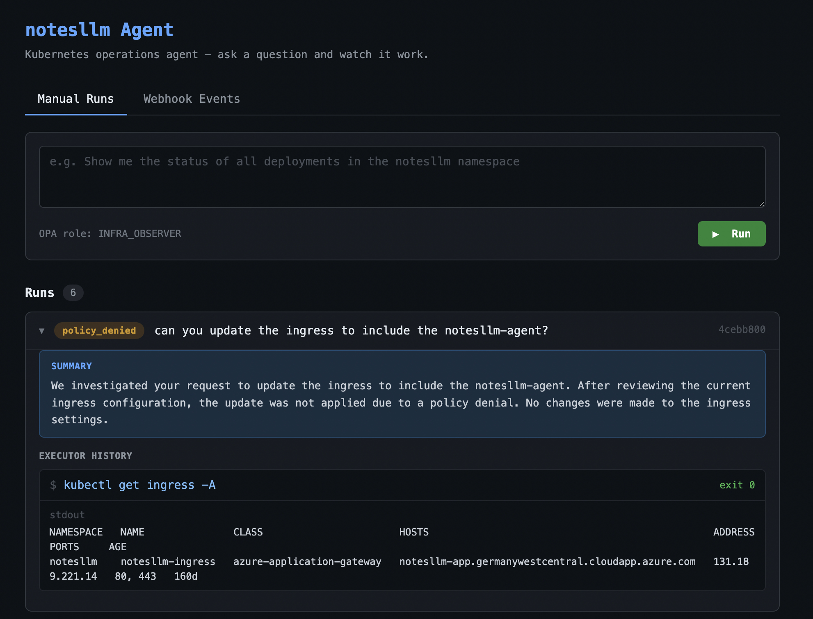

# llm-opa-agent

A personal developer companion agent that runs locally on your machine. Give it a natural-language prompt, and it plans and executes a sequence of CLI commands using tools you define — validated against an OPA policy before each execution.



---

## How it works

```
prompt
  └── Planner.next_action()     ← LLM decides: run command / done / failed
        └── PolicyEvaluator.evaluate()  ← OPA allows or denies
              └── CommandExecutor.run() ← subprocess executes
                    └── result appended to history → repeat
```

The agent uses **skills** — descriptors you write that tell the LLM what CLI tools are available and how to invoke them. Add a skill for `kubectl`, `gh`, `terraform`, or anything else you have installed. Manage skills through the browser UI.

---

## Install

**Prerequisites:**
- Python 3.12+
- An OpenAI-compatible LLM endpoint (OpenAI, Azure OpenAI, Ollama, etc.)
- Any CLI tools you want the agent to use (install them yourself with `brew`, `apt`, etc.)

```sh
# 1. Clone and install
git clone <repo-url>
cd llm-opa-agent
pip install -e ".[dev]"

# 2. Configure
cp .env.example .env
# Edit .env — set LLM_BASE_URL, LLM_API_KEY, LLM_MODEL, POLICY_PATH at minimum

# 3. Create a policy (allow-all for development)
echo 'package ops.agent\ndefault allow = true' > /tmp/dev-policy.rego
# Then set POLICY_PATH=/tmp/dev-policy.rego in .env

# 4. Run
uvicorn app.main:app --reload --port 8081
```

Open `http://localhost:8081`.

---

## First steps

1. Open the **Skills** tab in the browser UI.
2. Click **Add Skill** and describe a CLI tool you want the agent to use. Example:

   **Name:** `kubectl`

   **Description:**
   ```
   Kubernetes CLI. Use to inspect and manage cluster resources.

   Common patterns:
   - kubectl get pods -n <namespace>
   - kubectl logs <pod> -n <namespace>
   - kubectl describe deployment <name> -n <namespace>
   - kubectl rollout restart deployment/<name> -n <namespace>

   Always specify -n <namespace>. Never delete resources unless explicitly asked.
   ```

3. Switch to **Manual Runs** and type a prompt. The agent will use your enabled skills.

---

## Configuration

| Variable | Required | Default | Description |
|---|---|---|---|
| `LLM_BASE_URL` | yes | — | Base URL of the OpenAI-compatible API |
| `LLM_API_KEY` | yes | — | API key |
| `LLM_MODEL` | no | `gpt-4.1` | Model name |
| `POLICY_PATH` | yes | — | Absolute path to a `.rego` policy file |
| `MAX_ITERATIONS` | no | `10` | Maximum plan→validate→execute cycles per run |
| `SKILLS_FILE` | no | `./skills.json` | Path where skills are stored |

---

## OPA Policy

The agent will not execute any command unless the policy returns `allow = true`. Set `POLICY_PATH` to point to a Rego file.

**Allow-all (development only):**
```rego
package ops.agent
default allow = true
```

**Example — restrict to read-only kubectl:**
```rego
package ops.agent

default allow = false

allowed_prefixes := [
  ["kubectl", "get"],
  ["kubectl", "describe"],
  ["kubectl", "logs"],
]

allow {
  some prefix
  prefix = allowed_prefixes[_]
  array.slice(input.argv, 0, count(prefix)) = prefix
}
```

The policy receives `input.argv` — the proposed command as a list of strings.

---

## API

| Method | Path | Description |
|---|---|---|
| `POST` | `/api/agent/run` | Start a run. Body: `{"prompt": "..."}` |
| `GET` | `/api/agent/runs/{run_id}` | Get run status and history |
| `GET` | `/api/agent/runs` | List all runs |
| `POST` | `/api/agent/webhook` | Accept a webhook payload and run autonomously |
| `GET` | `/api/skills` | List skills |
| `POST` | `/api/skills` | Create a skill |
| `PATCH` | `/api/skills/{id}` | Update a skill |
| `DELETE` | `/api/skills/{id}` | Delete a skill |
| `GET` | `/health` | Health check |

---

## Development

```sh
# Run tests
pytest

# Run with auto-reload
uvicorn app.main:app --reload --port 8081
```
