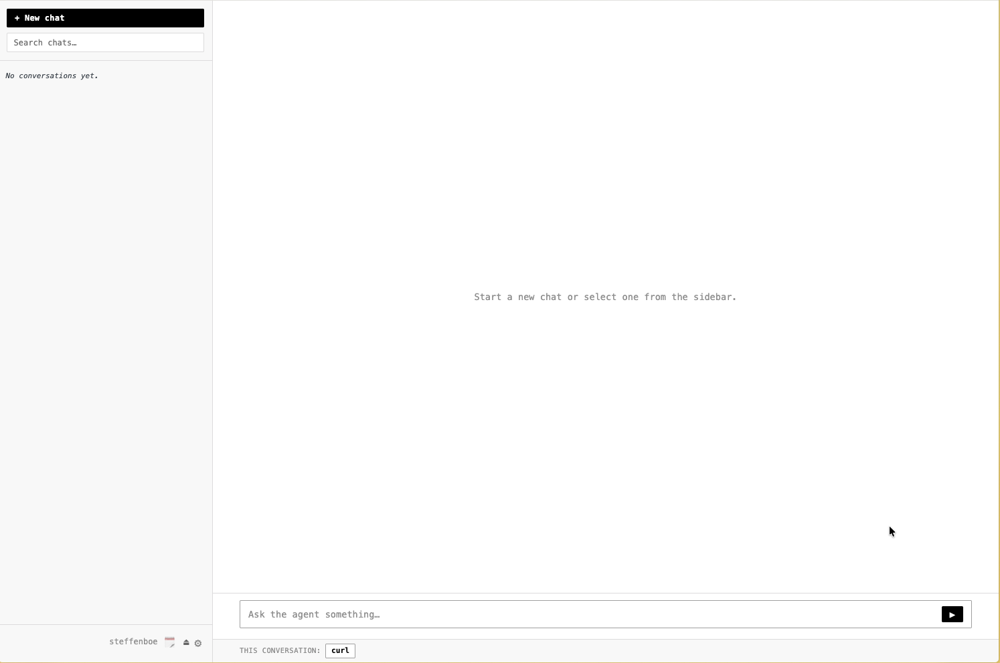

# NclaveOS Agentic Operating System
*An Early-Access Open Source Project Made by Exxeta*

> KI-Agenten für Teams — governed, auditierbar, self-hosted

<br>

<div style="display:flex; gap:1em; flex-wrap:wrap;">
  <span class="pill">🔒 OPA Policy Gate</span>
  <span class="pill">👥 Multi-User RBAC</span>
  <span class="pill">🔑 Secret Isolation</span>
  <span class="pill">✋ Approval Gate</span>
  <span class="pill">📋 Audit Trail</span>
  <span class="pill">⏰ Scheduled Tasks</span>
</div>

---

## Das Problem

<div class="cols">
<div>

### Jeder baut sich eigenen Agenten Stack
Jeder konfiguriert lokal — keine gemeinsamen Skills, keine einheitlichen Policies.

### Kein Audit
Was hat der Agent auf Prod gemacht? Weiß keiner.

</div>
<div>

### Secrets im Prompt
API-Keys landen im LLM-Kontext, in Logs, in der Bash-History.

### Kein Gate
Der Agent kann Prod-Ressourcen löschen — nichts hält ihn auf.

</div>
</div>

---

## Introducing: NclaveOS Agentic Operating System 
*From personal automation to governed agent infrastructure*
<div class="cols-vcenter">
<div>



</div>
<div>

- **zentral gehostetes** Agenten-Management
- Agenten planen und führen Commands aus
- Skills und Systemzugriffe zentral verwaltet
- deterministische Guardrails zentral konfigurierbar
- opt. Approval-Gate vor Commands
- Audit Trails
- Cron-Jobs
- [...] 

</div>
</div>

---

## Lokaler Assistent vs. governed Platform


<div class="center-table">

| Fähigkeit | Claude Desktop / MCP | nclaveOS |
|---|:---:|:---:|
| Multi-User mit Rollen | ✗ | ✓ |
| Policy-gated Execution | ✗ | ✓ OPA Rego |
| Secret-Isolation | ✗ | ✓ |
| Human Approval Gate | ✗ | ✓ |
| Scheduled Tasks | ✗ | ✓ Cron |
| Audit Trail | ✗ | ✓ |
| Gemeinsame Skill-Bibliothek | ✗ | ✓ Git |
| Self-hosted | manchmal | ✓ immer |

</div>

---

## Wie es funktioniert

<br>

| 👤 Prompt | → | 🧠 Planner (LLM) | → | 🛡️ OPA Policy | ✅ → | ⚙️ Executor | → | 📋 Audit Trail |
|:---:|:---:|:---:|:---:|:---:|:---:|:---:|:---:|:---:|
| | | ↑ result | | 🚫 deny | | | | |

<br>

> Planner → OPA → Executor → result zurück an Planner — Loop bis *done* oder *failed*

---

## Skills

<div class="cols">
<div>

```yaml
name: kubectl-readonly
description: |
  Read-only k8s CLI.
  Only get, describe, logs, top.
policy: |
  allowed := {"get","describe","logs","top"}
  allow {
    input.argv[0] == "kubectl"
    allowed[input.argv[1]]
  }
env:
  - KUBECONFIG_TOKEN
```

</div>
<div>

**Admins definieren:**
- welche Tools verfügbar sind
- welche Commands erlaubt sind
- welche Secrets injiziert werden

**Verteilt via** Git-Repository →  
ein Sync-Klick, alle Teams haben dieselben Skills.

</div>
</div>

---

## OPA als Ausführungsgate

| Command | OPA | Ergebnis |
|---|:---:|:---:|
| `kubectl delete pod x` | `delete ∉ allowed` | 🚫 blocked |
| `kubectl get pods -n prod` | `get ∈ allowed` | ✅ executed |
| `rm -rf /` | kein Skill matched | 🚫 blocked |

<br>

Globale Policy + optionale **per-Skill-Policy** — in-process, kein Netzwerk-Round-Trip.

---

## Secret-Isolation

| | sieht |
|---|---|
| 🧠 LLM | `${GITHUB_TOKEN}` — Placeholder |
| 📋 Audit Trail | `${GITHUB_TOKEN}` — Placeholder |
| ⚙️ Subprocess | `GITHUB_TOKEN=ghp_xxxx` — echter Wert |
| `secrets.json` | `chmod 600`, gitignored — nur der Server liest es |

<br>

Secrets verlassen **nie** den Subprocess — nicht im LLM-Kontext, nicht in Logs, nicht in der Run-History.

---

## Browser-UI

<div class="cols">
<div>

**Nutzer**
- 💬 Chat-Interface
- ✋ Approve / Deny per Command
- 📋 Run-History durchsuchen
- 🔧 Skills pro Chat aktivieren
- ⏰ Scheduled Tasks (Cron)

</div>
<div>

**Admins**
- 👥 User-Verwaltung + Rollen
- ⚙️ LLM-Endpoint & Modell
- 📦 Skills (inkl. Guardrails) erstellen, testen und ausrollen
- 🌐 Approval global ein/ausschalten

</div>
</div>

---

## Deployment

```bash
docker compose up -d
```

| | Option A | Option B |
|---|---|---|
| **LLM-Backend** | OpenAI / Azure OpenAI | Ollama (lokal) |
| **Persistenz** | JSON Files (default) | MongoDB via `MONGODB_URI` |
| **Port** | `:8081` | `:8081` |

---

## Roadmap

| Feature | Status |
|---|:---:|
| Per-Chat Model Selection | 🔧 In Planung |
| Webhook-Trigger | 🔧 In Planung |
| Kubernetes Helm Chart | 🔧 In Planung |
| Skill Marketplace | 💡 Idee |

---

## Mitmachen

<div class="cols">
<div>

**Nutzer**
1. `docker compose up -d`
2. Skill laden
3. Run starten

</div>
<div>

**Contributor**
1. Fork + Feature Branch
2. `pytest` / `npm run test`
3. Pull Request

</div>
</div>

<br>

> MIT License · © 2026 Exxeta AG · `github.com/exxeta/nclaveos`
